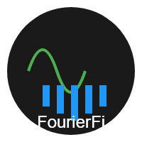

# FourierFi

<div align="center">
  
  <p>
    <strong>FourierFi</strong> - Advanced Financial Analysis Platform
  </p>
  <p>
    <a href="https://fourierfi.xyz">Website</a> •
    <a href="https://x.com/AI_FourierFI">Twitter</a>
  </p>
</div>

## Overview

FourierFi is a cutting-edge financial analysis platform that leverages advanced mathematical models and real-time market data to provide sophisticated trading insights. Our platform combines traditional technical analysis with innovative frequency domain analysis to offer a unique perspective on market movements.

## Key Features

### Real-time Market Analysis
- **Live Price Updates**: Instant market data streaming via WebSocket
- **Multiple Timeframes**: Support for various time intervals (1m, 5m, 15m, 1h, 4h, 1d)
- **Volume Analysis**: Real-time volume tracking and analysis
- **Price Alerts**: Customizable price notifications

### Technical Indicators
- **Moving Averages**
  - Simple Moving Average (SMA)
  - Exponential Moving Average (EMA)
- **Momentum Indicators**
  - Relative Strength Index (RSI)
  - Moving Average Convergence Divergence (MACD)
- **Volatility Indicators**
  - Bollinger Bands
  - Average True Range (ATR)
- **Trend Indicators**
  - Stochastic Oscillator (KDJ)
  - Volume Weighted Average Price (VWAP)

### Advanced Charting
- **Interactive Charts**: Zoom, pan, and crosshair functionality
- **Multiple Chart Types**: Line, candlestick, and area charts
- **Customizable Layouts**: Save and load chart configurations
- **Technical Drawing Tools**: Trend lines, Fibonacci retracements

### Data Management
- **Data Export**: Export market data in CSV or JSON format
- **Historical Data**: Access to historical price data
- **Custom Indicators**: Create and save custom technical indicators
- **Data Visualization**: Multiple chart overlays and indicators

## Technical Stack

### Frontend
- **Framework**: Next.js 14 with App Router
- **Language**: TypeScript
- **UI Components**: React with Tailwind CSS
- **State Management**: React Context API
- **Real-time Data**: WebSocket integration
- **Charts**: Custom Canvas-based implementation

### Development Tools
- **Testing**: Jest and React Testing Library
- **Linting**: ESLint with TypeScript support
- **Code Formatting**: Prettier
- **Type Checking**: TypeScript strict mode
- **Build Tools**: Next.js build system

## Getting Started

### Prerequisites
- Node.js 18.0.0 or later
- npm 9.0.0 or later
- Modern web browser with JavaScript enabled

### Installation

1. Clone the repository:
   ```bash
   git clone https://github.com/yourusername/fourierfi.git
   cd fourierfi
   ```

2. Install dependencies:
   ```bash
   npm install
   ```

3. Create a `.env.local` file in the root directory and add your environment variables:
   ```env
   NEXT_PUBLIC_API_URL=https://api.fourierfi.xyz
   NEXT_PUBLIC_WS_URL=wss://api.fourierfi.xyz/ws
   ```

4. Start the development server:
   ```bash
   npm run dev
   ```

5. Open [http://localhost:3000](http://localhost:3000) in your browser.

### Development Commands
- `npm run dev`: Start development server
- `npm run build`: Build for production
- `npm run start`: Start production server
- `npm run test`: Run tests
- `npm run lint`: Run linter
- `npm run format`: Format code with Prettier

## Project Structure

```
src/
├── app/                 # Next.js app directory
│   ├── api/            # API routes
│   ├── layout.tsx      # Root layout
│   └── page.tsx        # Home page
├── components/          # React components
│   ├── charts/         # Chart-related components
│   │   ├── PriceChart.tsx
│   │   ├── ChartInteractions.tsx
│   │   └── DataExport.tsx
│   ├── common/         # Shared components
│   └── layout/         # Layout components
├── hooks/              # Custom React hooks
│   ├── useMarketData.ts
│   └── useTechnicalIndicators.ts
├── contexts/           # React contexts
├── services/           # API and external services
├── utils/              # Utility functions
└── types/              # TypeScript type definitions
```

## API Documentation

### WebSocket API
```typescript
// Connect to WebSocket
const ws = new WebSocket('wss://api.fourierfi.xyz/ws');

// Subscribe to price updates
ws.send(JSON.stringify({
  type: 'subscribe',
  symbol: 'BTC/USDT',
  timeframe: '1h'
}));

// Handle messages
ws.onmessage = (event) => {
  const data = JSON.parse(event.data);
  // Handle price updates
};
```

### REST API Endpoints
- `GET /api/v1/market/price`: Get current price
- `GET /api/v1/market/history`: Get historical data
- `GET /api/v1/analysis/indicators`: Get technical indicators
- `POST /api/v1/analysis/custom`: Create custom indicator

## Roadmap

### Phase 1: Foundation (Q2 2024)
- [x] Core platform architecture
- [x] Real-time market data integration
- [x] Basic technical indicators
- [x] Interactive charting system
- [ ] Mobile-responsive design optimization
- [ ] Performance optimization
- [ ] Initial user testing and feedback

### Phase 2: Enhancement (Q3 2024)
- [ ] Advanced technical indicators
  - [ ] Ichimoku Cloud
  - [ ] Elliott Wave
  - [ ] Fibonacci extensions
- [ ] Social features
  - [ ] User profiles
  - [ ] Watchlists
  - [ ] Share charts
- [ ] Trading integration
  - [ ] Paper trading
  - [ ] Portfolio tracking
  - [ ] Risk management tools
- [ ] API improvements
  - [ ] Rate limiting
  - [ ] Caching system
  - [ ] Documentation

### Phase 3: Expansion (Q4 2024)
- [ ] Multi-asset support
  - [ ] Cryptocurrencies
  - [ ] Stocks
  - [ ] Forex
- [ ] Advanced analytics
  - [ ] Machine learning models
  - [ ] Pattern recognition
  - [ ] Market sentiment analysis
- [ ] Community features
  - [ ] User forums
  - [ ] Strategy sharing
  - [ ] Expert insights
- [ ] Institutional features
  - [ ] API access
  - [ ] Custom indicators
  - [ ] Advanced reporting

### Phase 4: Innovation (Q1 2025)
- [ ] AI-powered insights
  - [ ] Predictive analytics
  - [ ] Automated trading signals
  - [ ] Risk assessment
- [ ] Cross-platform support
  - [ ] Desktop application
  - [ ] Mobile app
  - [ ] Browser extension
- [ ] Advanced customization
  - [ ] Custom themes
  - [ ] Layout templates
  - [ ] Indicator builder
- [ ] Enterprise solutions
  - [ ] Team collaboration
  - [ ] Advanced security
  - [ ] Custom integrations

### Future Considerations
- [ ] Decentralized data feeds
- [ ] Cross-chain analysis
- [ ] DeFi integration
- [ ] Institutional partnerships
- [ ] Global market expansion
- [ ] Advanced AI models
- [ ] Community governance
- [ ] Token economics

## Contributing

We welcome contributions! Please see our [Contributing Guidelines](CONTRIBUTING.md) for details on:
- Code of Conduct
- Development Process
- Pull Request Process
- Coding Standards
- Testing Requirements

## License

This project is licensed under the MIT License - see the [LICENSE](LICENSE) file for details.

## Acknowledgments

- Thanks to all contributors who have helped shape FourierFi
- Special thanks to the open-source community for their invaluable tools and libraries
- Inspired by the power of Fourier transforms in financial analysis 